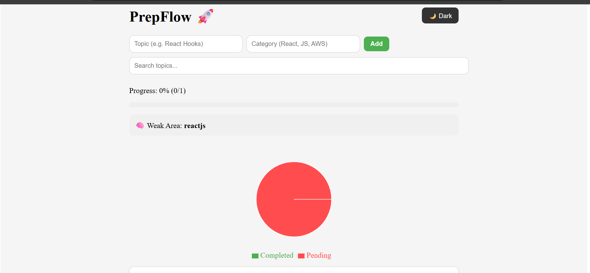

# 🚀 PrepFlow – Smart Interview Preparation Tracker

PrepFlow is a modern React-based productivity app designed to help developers track their interview preparation efficiently.
It provides smart insights like **progress tracking, weak area detection, and streak system** to improve consistency and performance.

---

## 📸 Screenshots

### 🌙 Dark Mode Dashboard


### ☀️ Light Mode Dashboard


### 📊 Analytics & Charts



## ✨ Features

* ✅ Add / Delete / Complete Topics (CRUD)
* 🔍 Debounced Search (optimized performance)
* 📊 Progress Tracking with visual bar
* 📈 Charts (Completed vs Pending)
* 🧠 Weak Area Detection (smart analytics)
* 🔥 Daily Streak System (consistency tracking)
* 🌙 Dark / Light Mode (persistent theme)
* 💾 LocalStorage persistence
* 🎨 Modern UI with responsive layout

---

## 🧠 Smart Features Explained

### 🔥 Streak System

Tracks how many consecutive days you completed topics.

### 🧠 Weak Area Detection

Automatically identifies the category where your performance is lowest.

### 📊 Progress Analytics

Visual representation of completed vs pending topics.

---

## 🛠 Tech Stack

* ⚛️ React (Vite)
* 🧠 Context API (Global State)
* 🪝 Custom Hooks (useDebounce)
* 📊 Recharts (Data Visualization)
* 💾 LocalStorage (Persistence)
* 🎨 Inline Styling (UI Design)

---

## 📂 Folder Structure

```
src/
├── components/
├── pages/
├── context/
├── hooks/
├── App.jsx
├── main.jsx
```

---

## 🚀 Getting Started

### 1️⃣ Clone the repository

```bash
git clone https://github.com/your-username/prepflow.git
```

### 2️⃣ Install dependencies

```bash
npm install
```

### 3️⃣ Run the app

```bash
npm run dev
```

---

## 💼 Resume Description (Use This)

**PrepFlow – Smart Interview Tracker**
Built a React-based productivity application to track interview preparation with features like debounced search, progress analytics, streak tracking, and weak area detection. Implemented Context API for global state management and optimized performance using custom hooks.

---

## 🌟 Future Enhancements

* 🔐 Authentication system
* 📊 Category-wise analytics
* 🔔 Notifications for streak reminders
* ☁️ Backend integration (Node.js / Firebase)

---

## 🙌 Author

Made with ❤️ by **[bhavini]**

---

## ⭐ If you like this project

Give it a ⭐ on GitHub and share it!
